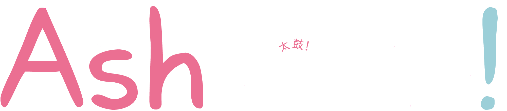

<!-- Improved compatibility of back to top link: See: https://github.com/othneildrew/Best-README-Template/pull/73 -->

<!-- PROJECT LOGO -->
 

  

<h3 align="center">AshTaiko!</h3>
  

    A clean, modern Taiko-style rhythm game, compatible with TJA and osu! formats.
  

    This is a repository for my SAT project for Software Development Units 3/4, 
    as part of part of the VCE (Victorian Certificate of Education)

